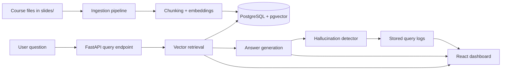

# RAG-Based Course FAQ System

An end-to-end retrieval-augmented question answering system for university course materials, built to answer questions from uploaded lecture files while exposing how grounded each answer really is. The project combines ingestion, vector search, answer generation, hallucination detection, query logging, and benchmark-based evaluation in one full-stack workflow.

This repository is especially useful as a portfolio project because it does not stop at "RAG works." It measures whether retrieval actually improves answer safety compared with a no-retrieval baseline.

## Table of Contents

- [Why This Project Stands Out](#why-this-project-stands-out)
- [Key Results](#key-results)
- [Tech Stack](#tech-stack)
- [How the System Works](#how-the-system-works)
- [Architecture](#architecture)
- [Getting Started](#getting-started)
- [Environment Variables](#environment-variables)
- [API Reference](#api-reference)
- [Evaluation Workflow](#evaluation-workflow)
- [Project Structure](#project-structure)
- [What I Would Improve Next](#what-i-would-improve-next)

## Why This Project Stands Out

- Built a complete RAG pipeline rather than an isolated notebook or prompt demo.
- Supports ingestion of real course assets in `PDF`, `PPTX`, and `DOCX` formats.
- Uses `pgvector` and semantic retrieval to ground answers in source material.
- Requires source-cited answers and runs a second LLM pass to detect unsupported claims.
- Persists query history and hallucination outcomes for later inspection.
- Includes a repeatable evaluation harness that compares baseline generation versus retrieval-backed generation on a fixed golden dataset.

## Key Results

The evaluation pipeline in `backend/app/evaluation.py` benchmarks the system against a no-retrieval baseline using course notes from **ELEC 472 Artificial Intelligence (Chapters 1-5)** and a **50-question golden dataset** stored in `backend/data/golden_dataset.json`.

Main finding: the RAG pipeline reduces hallucinations from **82% to 28%**, a **54 percentage-point drop** compared with the baseline LLM.

| Metric | Baseline LLM | RAG System | Why it matters |
| --- | --- | --- | --- |
| Questions evaluated | 50 | 50 | Uses a fixed benchmark instead of anecdotal prompts |
| Accuracy | 68% | 62% | Measures end-to-end answer correctness |
| Hallucination rate | 82% | 28% | Lower is better; shows substantially stronger grounding |
| Retrieval Hit@5 | N/A | 12% | Checks whether relevant evidence appears in the top 5 chunks |
| Retrieval MRR | N/A | 0.068 | Measures how early relevant evidence appears in ranked retrieval |
| Abstention accuracy | N/A | 50% | Measures whether the system appropriately says the source material is insufficient |

This is a realistic tradeoff that matters in production AI systems: the baseline model is slightly stronger on raw accuracy, but the RAG system is much less likely to fabricate unsupported claims.

## Tech Stack

| Layer | Technology |
| --- | --- |
| Frontend | React 18, Vite |
| Backend API | FastAPI, Uvicorn |
| Database | PostgreSQL 16 |
| Vector Search | pgvector |
| Embeddings | `text-embedding-3-small` |
| Generation Model | `gpt-4o-mini` |
| Document Parsing | PyMuPDF, python-pptx, python-docx |
| Chunking | LangChain text splitters |
| Runtime | Docker Compose |

## How the System Works

1. Course files are placed in the root `slides/` directory.
2. The backend scans the folder recursively for supported file types: `.pdf`, `.pptx`, and `.docx`.
3. Each document is parsed into page- or slide-level text.
4. Text is chunked into overlapping segments for retrieval.
5. Each chunk is embedded and stored in PostgreSQL with a `pgvector` column.
6. When a user asks a question, the backend embeds the query and retrieves the top matching chunks.
7. The generator answers using only the retrieved context and is instructed to cite sources.
8. A separate hallucination detector judges whether the answer is fully supported by the retrieved evidence.
9. The full interaction is written to a log table for review in the UI.

## Architecture

### High-Level Flow



### Backend Responsibilities

- `main.py`: FastAPI app, API routes, startup lifecycle, and request orchestration.
- `ingest.py`: file discovery, format-specific parsing, chunking, and embedding generation.
- `retrieval.py`: vector similarity search over stored chunks.
- `generation.py`: context-constrained answer synthesis with source citations.
- `hallucination.py`: secondary LLM judge that flags unsupported claims.
- `db.py`: schema creation, chunk insertion, and persistent query logging.
- `evaluation.py`: batch benchmark comparing baseline versus RAG performance.

### Data Model

The backend initializes two core tables:

- `chunks`: stores source metadata, page numbers, chunk text, and embeddings.
- `query_logs`: stores each question, answer, retrieved chunks, hallucination flag, explanation, and timestamp.

### Product Experience

The React frontend provides two core workspaces:

- `Query`: ingest files, ask questions, view answers, and inspect retrieved chunks.
- `Logs`: review previous runs, timestamps, and hallucination outcomes.

## Getting Started

### Prerequisites

- Docker Desktop or another Docker-compatible runtime
- An OpenAI API key
- Course materials to place in `slides/`

### 1. Clone the Repository

```bash
git clone https://github.com/your-username/rag-based-course-faq-system.git
cd rag-based-course-faq-system
```

### 2. Create the Backend Environment File

The backend Docker image copies `backend/.env` during build, so create it before starting the stack.

```bash
cp backend/.env.example backend/.env
```

Then add your API key:

```env
OPENAI_API_KEY=your_key_here
DATABASE_URL=postgresql://postgres:password@db:5432/courserag
```

`DATABASE_URL` already matches the default Docker Compose setup, so in most cases you only need to supply `OPENAI_API_KEY`.

### 3. Add Source Documents

Place course material in the root `slides/` folder.

Supported file types:

- `.pdf`
- `.pptx`
- `.docx`

The ingestion job skips documents that have already been indexed by filename.

### 4. Start the Application

```bash
docker-compose up --build
```

This starts three services:

- `db` on `localhost:5432`
- `backend` on `localhost:8000`
- `frontend` on `localhost:5173`

### 5. Trigger Ingestion

Once the stack is running, ingest the files from `slides/`:

```bash
curl -X POST http://localhost:8000/ingest
```

Expected response shape:

```json
{
  "files_processed": 3,
  "chunks_stored": 42
}
```

### 6. Open the UI

Visit [http://localhost:5173](http://localhost:5173).

From there you can:

- ingest course files from the dashboard
- ask questions against the indexed corpus
- inspect the retrieved evidence chunks
- review prior query logs and hallucination outcomes

### 7. Ask a Question

Example request:

```bash
curl -X POST http://localhost:8000/query \
  -H "Content-Type: application/json" \
  -d "{\"question\": \"What is heuristic search?\"}"
```

## Environment Variables

| Variable | Required | Purpose | Default / Notes |
| --- | --- | --- | --- |
| `OPENAI_API_KEY` | Yes | Used for embeddings, answer generation, and hallucination detection | Must be provided in `backend/.env` |
| `DATABASE_URL` | Yes | PostgreSQL connection string | Docker Compose provides a working default |
| `GOLDEN_DATASET_PATH` | No | Path to the benchmark dataset used by `/evaluate` | Set automatically in Docker Compose to `/app/data/golden_dataset.json` |
| `SLIDES_PATH` | No | Folder scanned by the ingestion endpoint | Defaults to `/app/slides` in Docker |

## API Reference

| Method | Endpoint | Purpose |
| --- | --- | --- |
| `POST` | `/ingest` | Scans the `slides/` folder, parses supported files, chunks content, generates embeddings, and stores vectors |
| `POST` | `/query` | Retrieves relevant chunks, generates an answer, runs hallucination detection, and logs the interaction |
| `GET` | `/logs` | Returns query logs in reverse chronological order |
| `POST` | `/evaluate` | Runs the benchmark pipeline on the golden dataset and returns a structured evaluation summary |

### `POST /query`

Request body:

```json
{
  "question": "What is heuristic search?"
}
```

Response shape:

```json
{
  "answer": "Heuristic search uses domain knowledge to guide exploration toward promising states [Chapter3.pptx, page 8].",
  "chunks": [
    {
      "content": "...",
      "source": "Chapter3.pptx",
      "chapter": "Chapter 3",
      "page_number": 8,
      "similarity": 0.91
    }
  ],
  "hallucination": {
    "hallucinated": false,
    "detail": "All factual claims are supported by the retrieved chunks."
  }
}
```

## Evaluation Workflow

The benchmark harness compares:

- a baseline `gpt-4o-mini` answer with no retrieval context
- the RAG pipeline using retrieved chunks from the vector database

The evaluator computes:

- accuracy
- average correctness score
- hallucination rate
- faithfulness rate
- abstention accuracy
- retrieval Hit@1, Hit@3, Hit@5
- retrieval MRR
- context precision at 5
- grouped summaries by question type and category

Run the evaluation through the API:

```bash
curl -X POST http://localhost:8000/evaluate
```

Or run it directly inside the backend container:

```bash
docker-compose exec backend python -m app.evaluation
```

The dataset currently contains **50** benchmark questions in `backend/data/golden_dataset.json`.

## Project Structure

```text
rag-based-course-faq-system/
├── docker-compose.yml
├── README.md
├── slides/                    # Local course material mounted into the backend container
├── backend/
│   ├── Dockerfile
│   ├── requirements.txt
│   ├── .env.example
│   ├── data/
│   │   └── golden_dataset.json
│   └── app/
│       ├── main.py
│       ├── db.py
│       ├── ingest.py
│       ├── retrieval.py
│       ├── generation.py
│       ├── hallucination.py
│       └── evaluation.py
└── frontend/
    ├── Dockerfile
    ├── package.json
    └── src/
        ├── App.jsx
        └── components/
```

## What I Would Improve Next

If I were continuing this project, the next upgrades would be:

- add authentication and per-user document collections
- support incremental re-indexing when a source file changes
- expose citations more explicitly in the UI
- add automated tests around ingestion and API contracts
- store evaluation histories so benchmark runs can be compared over time
- improve retrieval quality with metadata filtering, reranking, or hybrid search
